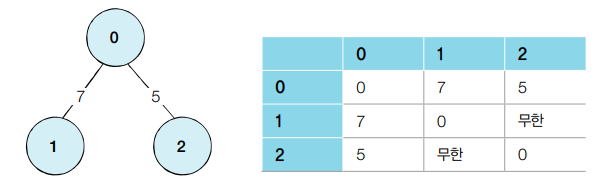
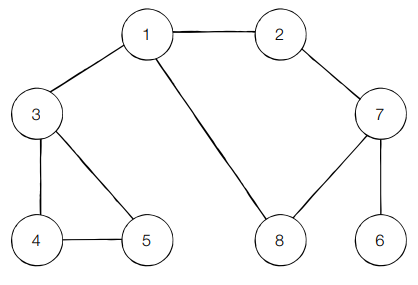
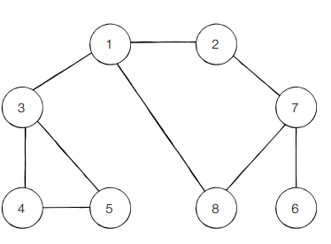

# DFS/BFS

## 자료구조 기초

- 탐색 (Search)
  - 많은 양의 데이터 중에서 원하는 데이터를 찾는 과정
  - 그래프, 트리 등의 자료구조 안에서 탐색하는 문제
  - 대표적인 탐색 알고리즘 : DFS, BFS


- 자료구조 (Data Strctur)
  - 데이터를 표현하고 관리하고 처리하기 위한 구조
  - 스택, 큐
  - 삽입 (Push) : 데이터를 삽입한다.
  - 삭제 (Pop) : 데이터를 삭제한다.
  - 오버플로 (Overflow): 특정한 자료구조가 수용할 수 있는 데이터 크기를 가득 찬 상태에서 삽입 연상을 수행할 때 발생
  - 언더플로 (Underflow): 데이터가 전혀 들어 있지 않은 상태에서 삭제 연산 수행


### 스택

- 선입후출 (First in Last Out) / 후입선출(Last In First Out)

- 예시)  삽입(5) - 삽입(2) - 삽입(3) - 삽입(7) - 삭제() - 삽입(1) - 삽입(4) - 삭제()

- ```
  step 1 : 5
  step 2 : 5-2
  step 3 : 5-2-3
  step 4 : 5-2-3-7
  step 5 : 5-2-3
  step 6 : 5-2-3-1
  step 7 : 5-2-3-1-4
  step 8 : 5-2-3-1
  ```

- ```python
  stack = []
  
  # 삽입(5) - 삽입(2) - 삽입(3) - 삽입(7) - 삭제() - 삽입(1) - 삽입(4) - 삭제()
  stack.append(5)
  stack.append(2)
  stack.append(3)
  stack.append(7)
  stack.pop()
  stack.append(1)
  stack.append(4)
  stack.pop()
  
  print(stack)  # 최하단 원소부터 출력
  print(stack[::-1]) # 최상단 원소부터 출력
  
  # >> [5,2,3,1]
  # >> [1,3,2,5]
  ```


### 큐

- 선입선출 (First In First Out)

- collections 모듈에서 제공하는 deque 자료구조 활용

- 데이터를 넣고 빼는 속도가 리스트 자료형에 비해 효율적이고 간단함

- 예시) 삽입(5) - 삽입(2) - 삽입(3) - 삽입(7) - 삭제() - 삽입(1) - 삽입(4) - 삭제()

- ```
  step 1 : 5
  step 2 : 2-5
  step 3 : 3-2-5
  step 4 : 7-3-2-5
  step 5 : 7-3-2
  step 6 : 1-7-3-2
  step 7 : 4-1-7-3-2
  step 8 : 4-1-7-3
  ```

- ```python
  from collection import deque
  
  # 큐(Queue) 구현을 위해 deque 라이브러리 사용
  queue = deque()
  
  # 삽입(5) - 삽입(2) - 삽입(3) - 삽입(7) - 삭제() - 삽입(1) - 삽입(4) - 삭제()
  queue.append(5)
  queue.append(2)
  queue.append(3)
  queue.append(7)
  queue.popleft()
  queue.append(1)
  queue.append(4)
  queue.popleft()
  
  print(queue)  # 먼저 들어온 순서대로 출력
  queue.reverse()  # 다음 출력을 위해 역순으로 바꾸기
  print(queue)  # 나중에 들어온 원소부터 출력
  
  # >> deque([3, 7, 1, 4])
  # >> deque([4, 1, 7, 3])
  ```

- deque 객체를 리스트 자료형으로 변경하고자 한다면 list() 메서드를 이용


### 재귀 함수

- 자기 자신을 다시 호출하는 함수

- ```python
  def recursive_function():
      print("재귀 함수를 호출합니다.")
      recursive_function()
      
  recursive_function()
  
  # >> 재귀 함수를 호출합니다. (무한 출력)
  ```


#### 재귀 함수의 종료 조건

- 재귀 함수를 사용할 때는 종료 조건을 꼭 명시해야 함

- ```python
  def recursive_function():
      # 100번째 출력했을 떄 종료되도록 종료 조건 명시
      if i == 100:
          return
      print(i, '번째 재귀 함수에서', i+1 , '번째 재귀 함수를 호출합니다.')
      recursive_function(i+1)
      print(i, '번째 재귀 함수를 종료합니다.')
      
  recursive_function(1)
  ```


- 팩토리얼(Factorial)

  - n! = 1x2x3x...x(n-1)xn

  - ```python
    # 반복적으로 구현한 n!
    def factorial_iterative(n):
        result = 1
        # 1부터 n까지의 수를 차례대로 곱하기
        for i in range(1, n+1):
            result += 1
        return result
    
    # 재귀적으로 구현한 n!
    def factorial_recursive(n):
        if n<=1:  # n이 1 이하인 경우 1을 반환
            return 1
        # n! = n*(n-1)를 그대로 코드로 작성하기
        return n * factorial_recursive(n-1)
    
    # 각각의 방식으로 구현한 n! 출력 (n=5)
    print("반복적으로 구현:", factorial_iterative(5))
    print("재귀적으로 구현:", factorial_recursive(5))
    
    # >> 반복적으로 구현: 120
    # >> 재귀적으로 구현: 120
    ```

    > n이 0 혹은 1일 때 : factorial(n) = 1
    >
    > n이 1 보다 클 때 : factorial(n) = n x factorial(n-1)


## 탐색 알고리즘 DFS/BFS

### DFS (Depth-First Search)

- 깊이 우선 탐색
- 그래프에서 깊은 부분을 우선적으로 탐색하는 알고리즘
- 그래프는 노드(Node)와 간선(Edge)으로 표현되며 이때 노드를 정점(Vertax)
- 그래프 탐색 : 하나의 노들르 시작으로 다수의 노드를 방문하는 것



- 인접 행렬 (Adjacency Matrix) : 2차원 배열로 그래프의 연결 관계를 표현하는 방식
- 인접 리스트 (Adjacency List) : 리스트 그래프의 연결 관게를 표현하는 방식


```python
# 인접 행렬 방식
INF = 99999999999 # 무한의 비용 선언

# 2차원 리스트를 이용해 인접 행렬 표현
graph = [
    [0, 7, 5],
    [7, 0, INF],
    [5, INF, 0]
]
print(graph)

# >> [[0, 7, 5],[7, 0, 99999999999],[5, 99999999999,0]]
```


```python
# 인접 리스트 방식
# 행(Row)이 3개만 2차원 리스트로 인접 리스트 표현
graph = [[] for _ in range(3)]

# 노드 0에 연결된 노드 정보 저장(노드, 거리)
graph[0].append((1,7))  # 0번 행 1번 열에 7
graph[0].append((2,5))  # 0번 행 2번 열에 5

# 노드 1에 연결된 노드 정보 저장(노드, 거리)
graph[1].apped((0,7))

# 노드 2에 연결된 노드 정보 저장(노드, 거리)
graph[2].append((0,5))

pirnt(graph)

# >> [[(1,7), (2,5)], [(0,7)], [0,5]]
```


- 인접 리스트 방식은 메모리를 효율적으로 사용하지만 정보를 얻는 속도는 느림
- 특정한 노드와 연결된 모든 인접 노드를 순회해야 하는 경우 >> **인접 리스트**가 메모리 공간의 낭비가 적기 때문에 효과적


- DFS  (깊이 우선 탐색 알고리즘)

  - 특정한 경로로 탐색하다가 특정한 상황에서 최대한 깊숙이 들어가서 노드를 방문한 후, 다시 돌아가 다른 경로로 탐색하는 알고리즘

  1. 탐색 시작 노드를 스택에 삽입하고 방문 처리를 함

  2. 스택의 최상단 노드에 방문하지 않은 인접 노드가 있으면 그 인접 노드를 스택에 놓고 방문 처리를 함. 

     방문하지 않은 인접 노드가 없으면 스택에서 최상단 노드를 꺼낸다.

  3. 2번 과정을 더 이상 수행할 수 없을 때까지 반복

  

  - 인접한 노드 중에서 방문하지 않은 노드가 여러 개 있으면 번호가 낮은 순부터 처리

  

  | step | 스택    | 설명                                                         |
  | ---- | ------- | ------------------------------------------------------------ |
  | 1    | 1       | 시작 노드인 '1'을 스택에 삽입하고 방문 처리                  |
  | 2    | 1-2     | 최상단 노드 '1'에 방문하지 않은 인접 노드 '2','3','8' 중 가장 작은 노드인 2를 스택에 넣고 방문 처리 |
  | 3    | 1-2-7   | 스택의 최상단 노드인 '2'에 방문하지 않은 인접 노드 '7'을 스택에 넣고 방문 처리 |
  | 4    | 1-2-7-6 | 스택의 최상단 노드인 '7'에 방문하지 않은 인접 노드 '6','8' 중 가장 작은 노드인 '6'을 스택에 넣고 방문 처리 |
  | 5    | 1-2-7   | 스택의 최상단 노드인 '6'에 방문하지 않은 인접 노드가 없다. 따라서 스택에서 '6'번 노드를 꺼냄 |
  | 6    | 1-2-7-8 | 스택의 최상단 노드인 '7'에 방문하지 않은 인접 노드 '8'을 스택에 넣고 방문처리 |
  | 7    | 1-2-7   | 스택의 최상단 노드인 '8에 방문하지 않은 인접노드가 없다. 따라서 스택에서 '8'번 노드를 꺼냄 |
  | 8    | 1-2     | 스택의 최상단 노드인 '7에 방문하지 않은 인접노드가 없다. 따라서 스택에서 '7'번 노드를 꺼냄 |
  | 9    | 1       | 스택의 최상단 노드인 '2에 방문하지 않은 인접노드가 없다. 따라서 스택에서 '2'번 노드를 꺼냄 |
  | 10   | 1-3     | 스택의 최상단 노드인 '1'에 방문하지 않은 인접 노드 '3'을 스택에 넣고 방문처리 |
  | 11   | 1-3-4   | 스택의 최상단 노드인 '3'에 방문하지 않은 인접 노드 '4','5' 중 가장 노드인 '4'를 스택에 넣고 방문처리 |
  | 12   | 1-3-4-5 | 스택의 최상단 노드인 '4'에 방문하지 않은 인접 노드 '5'을 스택에 넣고 방문처리 |
  | 13   |         | 남아 있는 노드에 방문하지 않은 인접 노드가 없다. 따라서 모든 노드를 차례대로 꺼냄 |

  > 결과 : 1 -> 2 -> 7 -> 6 -> 8 -> 3 -> 4 -> 5
  >
  > O(N) 시간 소요

  ```python
  # DFS 메서드 정의
  def dfs(graph, v, visited):
      # 현재 노드를 방문 처리
      visited[v] = True
      print(v, end=' ')
      # 현재 노드와 연결된 다른 노드를 재귀적으로 방문
      for i in graph[v]:
          if not visitied[i]:
              dfs(graph, i, visited)
              
  # 각 노드가 연결된 정보를 리스트 자료형으로 표현(2차원 리스트)
  graph = [
      [],
      [2,3,8],
      [1,7],
      [1,4,5],
      [3,5],
      [3,4],
      [7],
      [2,6,8],
      [1,7]
  ]
  
  # 각 노드가 방문된 정보를 리스트 자료형으로 표현(1차원 리스트)
  visited = [False]*9
  
  # 정의된 DFS 함수 호출
  dfs(graph, 1, visited)
  
  # >> 1 2 7 6 8 3 4 5
  ```

  

### BFS (Breadth First Search)

- 너비 우선 탐색
- 가까운 노드부터 탐색하는 알고리즘
- 선입선출 방식인 큐 자료구조를 이용하는 것이 정석
- 인접한 노드를 반복적으로 큐에 넣도록 알고리즘 작성 -> 먼저 들어온 것이 먼저 나가게 되어, 가까운 노드부터 탐색 가능


1. 탐색 시작 노드를 큐에 삽입하고 방문 처리
2. 큐에서 노드를 꺼내 해당 노드의 인접 노드 중에서 방문하지 않은 노드를 모두 큐에 삽입하고 방문 처리
3. 2번 과정을 더 이상 수행할 수 없을 때까지 반복


- 인접한 노드가 여러 개 있을 때, 숫자가 작은 노드부터 먼저 큐에 삽입
- 큐에 원소가 들어올 때, 위에서 들어오고 아래쪽에서 꺼낸다고 가정



| step | 스택                  | 설명                                                         |
| ---- | --------------------- | ------------------------------------------------------------ |
| 1    | 1                     | 시작 노드인 '1'을 큐에 삽입하고 방문 처리                    |
| 2    | 2-3-8                 | 큐에서 노드 '1'을 꺼내고 방문하지 않은 인접 노드 '2','3','8'을 모두 큐에 삽입하고 방문 처리 |
| 3    | ( )-3-8-7             | 큐에서 노드 '2'를 꺼내고 방문하지 않은 인접 노드 '7'을 큐에 삽입하고 방문 처리 |
| 4    | ( )-( )-8-7-4-5       | 큐에서 노드 '3'을 꺼내고 방문하지 않은 인접 노드 '4','5'를 모두 큐에 삽입하고 방문 처리 |
| 5    | ( )-( )-( )-7-4-5     | 큐에서 노드 '8'을 꺼내고 방문하지 않은 인접 노드가 없으므로 무시 |
| 6    | ( )-( )-( )-( )-4-5-6 | 큐에서 노드 '7'을 꺼내고 방문하지 않은 인접 노드 '6'을 큐에 삽입하고 방문 처리 |
| 7    |                       | 남아 있는 노드에 방문하지 않은 인접 노드가 없다. 모든 노드를 차례대로 꺼냄 |

> 결과 : 1 -> 2 -> 3 -> 8 -> 7 -> 4 -> 5 -> 6
>
> O(N) 시간 소요

- 실제 수행 시간은 DFS보다 좋은 편
- deque 라이브러리 사용하는 것이 좋음


```python
from collection import deque

# BFS 메서드 정의
def bfs(graph, start, visited):
    # 큐(Queue) 구현을 위해 deque 라이브러리 사용
    queue = deque([start])
    # 현재 노드를 방문 처리
    visited[start] = True
    # 큐가 빌 때까지 반복
    while queue:
        # 큐에서 하나의 원소를 뽑아 출력
        v = queue.popleft()
        print(v, end=" ")
        # 해당 원소와 연결된, 아직 방문하지 않은 원소들을 큐에 삽입
        for i in graph[v]:
            if not visited[i]:
                queue.append(i)
                visited[i] = True
                
# 각 노드가 연결된 정보를 리스트 자료형으로 표현(2차원 리스트)
graph = [
    [],
    [2,3,8],
    [1,7],
    [1,4,5],
    [3,5],
    [3,4],
    [7],
    [2,6,8],
    [1,7]
]
# 각 노드가 방문된 정보를 리스트 자료형으로 표현 (1차원 리스트)
visited = [False]*9

# 정의된 BFS 함수 호출
bfs(graph, 1, visited)

# >> 1 2 3 8 7 4 5 6
```

